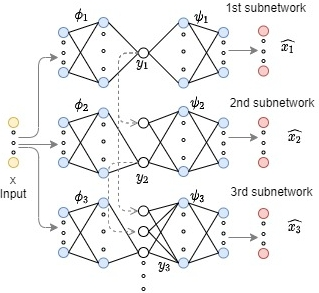
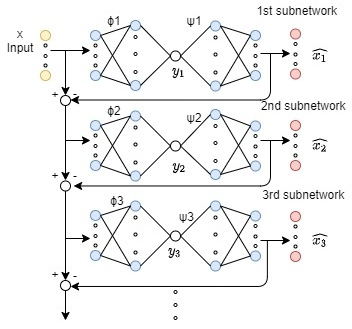
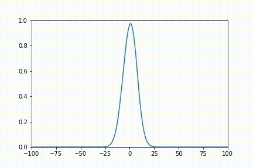
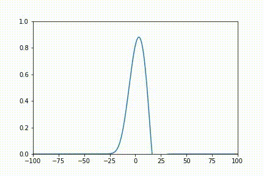
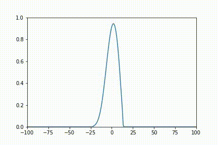
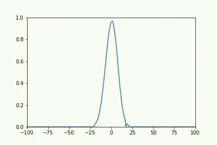
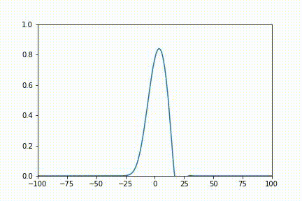
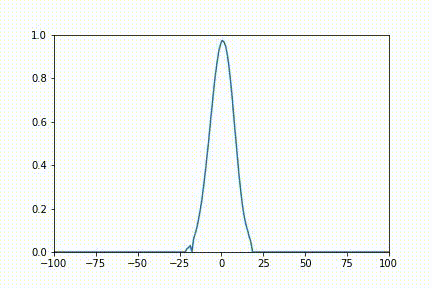
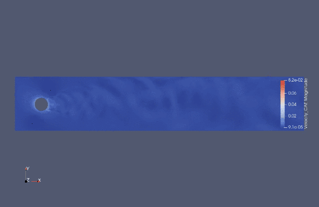

# acse-9-independent-research-project-fy120

## A comparison of dimensionality reduction methods for fluid flow problems focusing on hierarchical autoencoders

[](https://opensource.org/licenses/mit-license.php)


<br />
<p align="center">
  <a href="https://github.com/acse-fy120/acse-9-independent-research-project-fy120/blob/main/pics/POD architecture.jpg">
    
    <figcaption> Achitechture of principal component analysis</figcaption>
  </a>
</p>

<p align="center">
  <a href="https://github.com/acse-fy120/acse-9-independent-research-project-fy120/blob/main/pics/FCAE architecture.jpg">
    
    <figcaption> Achitechture of fully-connected autoencoder </figcaption>
  </a>
</p>

<p align="center">
  <a href="https://github.com/acse-fy120/acse-9-independent-research-project-fy120/blob/main/pics/SFCCAE architecture.jpg">
    
    <figcaption> Achitechture of space-filling-curve convolutional autoencoder </figcaption>
  </a>
</p>

<p align="center">
  <a href="https://github.com/acse-fy120/acse-9-independent-research-project-fy120/blob/main/pics/HAE.jpg">
    
    <figcaption> Achitechture of hierarchical autoencoder </figcaption>
  </a>
</p>

<p align="center">
  <a href="https://github.com/acse-fy120/acse-9-independent-research-project-fy120/blob/main/pics/SAE.jpg">
    
    <figcaption> Achitechture of sequential autoencoder </figcaption>
  </a>
</p>

<details open="open">
  <summary>Table of Contents</summary>
  <ol>
    <li>
      <a href="#project-description">Project Description</a>
    </li>
    <li>
      <a href="#getting-started">Getting Started</a>
      <ul>
        <li><a href="#download">Download</a></li>
        <li><a href="#directory-tree">Directory tree</a></li>
      </ul>
    </li>
    <li><a href="#Template-Notebooks">Colab Notebooks</a>
      <ul>
        <li><a href="#Burgers-equation">Burgers equation</a></li>
        <li>
            <a href="#Flow-past-cylinder">Flow past cylinder</a>
            <ul>
              <li><a href="#FPC-SFC-CAE">SFC-CAE</a></li>
              <li><a href="#FPC-SFC-HAE">SFC-HAE </a></li>
              <li><a href="#FPC-SFC-CAE">SFC-SAE</a></li>
              <li><a href="#FPC-SVD-AE">SVD-AE</a></li>
              <li><a href="#FPC-SFC-POD">POD</a></li>
            </ul>
        </li>
      </ul>   
    </li>
    <li><a href="#License">License</a></li>
    <li><a href="#Testing">Testing</a></li>
    <li><a href="#Contact">Contact</a></li>
    <li><a href="#Acknowledgements">Acknowledgements</a></li>
  </ol>
</details>


<!-- copy_over_N_files.py在压缩包中需要删除 -->
## Project Description
To investigate the application of the dimensionality reduction methods in fluid dynamics, this project implements and compares many dimensionality reduction methods including proper orthogonal decomposition(POD), fully-connected autoencoder (FC-AE), convolutional autoencoder (CAE), space-filling curve - convolutional autoencoder (SFC-CAE), hierarchical autoencoder (HAE) and sequential autoencoder (SAE). Moreover, the novel space-filling curve-hierarchical autoencoder (SFC-HAE) is proposed. The mentioned methods are assessed with two fluid solutions, namely: (1) burgers equation, (2) flow past cylinder, in terms of mean square error (MSE) and computation time. 
The project is based on the wokr of previous year https://arxiv.org/abs/2011.14820,https://github.com/ImperialCollegeLondon/SFC-CAE and paper https://arxiv.org/abs/2006.06977.

## Getting Started
### Download
1. Clone the repository:
```sh
$ git clone https://github.com/acse-fy120/acse-9-independent-research-project-fy120
```
2. Upload to the Google drive using Colab to open the ipynb files.

### Directory tree

#### Directory tree in Colab
Please configure the file on the Colab according to the directory tree in directory tree in local computer.txt in directory tree folder.
The link to download FPC_new_random_test.pt, FPC_new_random_total.pt, FPC_new_random_train.pt, FPC_new_random_valid.pt is https://drive.google.com/drive/folders/1UyJZ4ZqApOTnUIV-VwmIGoOIcxstq8VM?usp=sharing.

The most important csv folder and pkl folder of each method have been upload to this repertory. The csv folder is used to store the MSE of training data and validation data. The pkl folder store the trained model. The decoded_data/decoded folder and Error_data folder used in SAE store the output and residual of the first network respectively. The mode/mode_new folder used in HAE store the output of the encoder of the first network. Due to their large memory, they can't be upload to Github. However, the user can generate them by using the trained model by themself. The csv_data is the csv file of FPC_Re3900_DG_new, which can be gnerated using Convert_vtu_to_csv.ipynb.

#### Directory tree in local computer
The code about flow past cylinder data post-processing is preferable to be run on the local computer with Visual Studio Code because the file of vtu could be opened with Paraview on the local computer.
Please configure the file on the local computer according to the directory tree in local computer.txt in directory tree folder.

The FPC_Re3900_DG_new is the folder that contain the vtu files which is decompressed from FPC_Re3900_DG_new.zip. The link to download the FPC_Re3900_DG_new.zip is https://drive.google.com/file/d/1kmI5NIZD5sTJnJzHNXMrg3fVQLcEWb81/view?usp=sharing.


## Template Notebooks
### Burgers equation
[](http://colab.research.google.com/github/acse-fy120/acse-9-independent-research-project-fy120/blob/main/burgers_equation_methods/Burgers_equation.ipynb)
<p align="center">
  <p float="left">
     
     <a href="pics/original_BE.gif"><strong>Original Burgers equation</strong></a>
     
     <a href="pics/POD_BE_2variable.gif"><strong>Burgers equation POD 2 variables</strong></a>
     
     <a href="pics/FCAE_BE_2variable.gif"><strong>Burgers equation FC-AE 2 variables</strong></a>
     
     <a href="pics/CAE_BE_2variable.gif"><strong>Burgers equation CAE 2 variables</strong></a>
     
     <a href="pics/SVDAE_BE_2variable.gif"><strong>Burgers equation SVD-AE 2 variables</strong></a>
     
     <a href="pics/HAE_BE_2variable.gif"><strong>Burgers equation HAE 2 variables</strong></a>
  </p>
</p>


### Flow past cylinder
<p align="center">
  <p float="left">
     
     <a href="pics/Fpc-Orginal.gif"><strong>Original FPC</strong></a>
  </p>
</p>

#### SFC-CAE
[](http://colab.research.google.com/github/acse-fy120/acse-9-independent-research-project-fy120/blob/main/fpc_methods/SFC_CAE/FPC_SFC_CAE_Summary.ipynb)
<p align="center">
  <p float="left">
     
     <a href="pics/FPC_SFC_CAE_64.gif"><strong>FPC SFC-CAE 64 variables</strong></a>
  </p>
</p>

#### SFC-HAE
[](http://colab.research.google.com/github/acse-fy120/acse-9-independent-research-project-fy120/blob/main/fpc_methods/SFC_HAE/FPC_SFC_HAE_Summary.ipynb)
<p align="center">
  <p float="left">
     
     <a href="pics/Fpc-Hae_64.gif"><strong>FPC SFC-HAE 64 variables</strong></a>
  </p>
</p>

#### SFC-SAE
[](http://colab.research.google.com/github/acse-fy120/acse-9-independent-research-project-fy120/blob/main/fpc_methods/SFC_SAE/FPC_SFC_SAE_Summary.ipynb)
<p align="center">
  <p float="left">
     
     <a href="pics/Fpc-Sae_64.gif"><strong>FPC SFC-SAE 64 variables</strong></a>
  </p>
</p>

#### SVD-AE
[](http://colab.research.google.com/github/acse-fy120/acse-9-independent-research-project-fy120/blob/main/fpc_methods/FPC_SVD_AE_random.ipynb)
<p align="center">
  <p float="left">
     
     <a href="pics/FPC-SVDAE_64.gif"><strong>FPC SVD-AE 64 variables</strong><a>
  </p>
</p>

#### POD
[](http://colab.research.google.com/github/acse-fy120/acse-9-independent-research-project-fy120/blob/main/fpc_methods/FPC_POD.ipynb)
<p align="center">
  <p float="left">
     
     <a href="pics/Fpc-Pod_64.gif"><strong>FPC POD 64 variables</strong><a>
  </p>
</p>

## License
Under the  [MIT Licence](https://github.com/acse-fy120/acse-9-independent-research-project-fy120/blob/main/LICENSE) License.


## Contact
* fy120@imperial.ac.uk or yangfan9806@gmail.com

## Acknowledgements
Many thanks to my supervisors:
* Dr. Claire Heaney
* Prof. Christopher Pain 